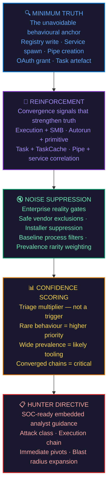
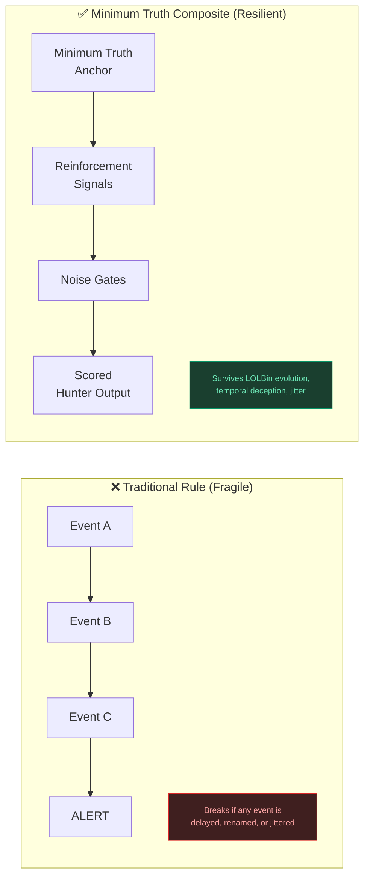
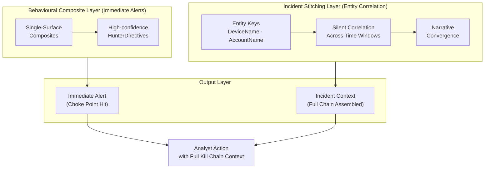

<div align="center">

```
███╗   ███╗██╗███╗   ██╗██╗███╗   ███╗██╗   ██╗███╗   ███╗    ████████╗██████╗ ██╗   ██╗████████╗██╗  ██╗
████╗ ████║██║████╗  ██║██║████╗ ████║██║   ██║████╗ ████║    ╚══██╔══╝██╔══██╗██║   ██║╚══██╔══╝██║  ██║
██╔████╔██║██║██╔██╗ ██║██║██╔████╔██║██║   ██║██╔████╔██║       ██║   ██████╔╝██║   ██║   ██║   ███████║
██║╚██╔╝██║██║██║╚██╗██║██║██║╚██╔╝██║██║   ██║██║╚██╔╝██║       ██║   ██╔══██╗██║   ██║   ██║   ██╔══██║
██║ ╚═╝ ██║██║██║ ╚████║██║██║ ╚═╝ ██║╚██████╔╝██║ ╚═╝ ██║       ██║   ██║  ██║╚██████╔╝   ██║   ██║  ██║
╚═╝     ╚═╝╚═╝╚═╝  ╚═══╝╚═╝╚═╝     ╚═╝ ╚═════╝ ╚═╝     ╚═╝       ╚═╝   ╚═╝  ╚═╝ ╚═════╝    ╚═╝   ╚═╝  ╚═╝
```

### Detection Framework — ADX-Validated Composite Rules

**Ala Dabat** · Senior Detection Engineer · Threat Hunter · Purple Team

[](https://github.com/azdabat/Minimum-Truth-Detection-Framework-ADX-Validated-Composite-Rules)
[](https://azdabat.github.io/Minimum-Truth-Detection-Framework-ADX-Validated-Composite-Rules/MITRE-MATRIX.html)
[](https://github.com/azdabat)
[](https://github.com/azdabat)
[](https://github.com/azdabat/Minimum-Truth-Detection-Framework-ADX-Validated-Composite-Rules/tree/main/Threat%20Hunting%20And%20R%26D%20Docs)
[](https://github.com/azdabat)

</div>

---

> *"A detection without offensive understanding is a pattern. A detection with offensive understanding is a trap."*

---

## The Problem With Most Detection Rules

Most enterprise SOC environments are defended by rules built on three flawed assumptions:

**1. Attackers follow predictable sequences.**  
Real intrusions are temporally fractured. C2 jitter, staged payloads, and multi-day dwell deliberately break join-dependent detection chains.

**2. A single event is enough to alert.**  
Single-event rules produce noise. Analysts tune them out or drown in false positives. Neither outcome serves defence.

**3. The rule's job ends at the alert.**  
An alert without analyst direction is a starting gun with no finish line. Context-free detection wastes the only thing SOC analysts don't have: time.

**This framework addresses all three.**

---

## The Minimum Truth Detection Framework

A five-layer methodology for building detections that survive real attacker behaviour, enterprise noise, and operational scale.



> **Reinforcement does not redefine truth — it strengthens it.**  
> A Minimum Truth anchor without reinforcement is a trip wire. With reinforcement, it is a proof.

---

## Composite vs. Monolithic Detection Architecture

Why composites survive where traditional rules fail:



The composite architecture forces **narrative convergence at the exact moment an attacker touches an unavoidable telemetric choke point** — regardless of timing, tooling, or evasion.

---

## R&D Publications & Purple Team Playbooks

> **Full research library:** [`Threat Hunting And R&D Docs /`](https://github.com/azdabat/Minimum-Truth-Detection-Framework-ADX-Validated-Composite-Rules/tree/main/Threat%20Hunting%20And%20R%26D%20Docs)

Each article maps the full attack chain from the offensive side, dissects the detection logic, and provides production-grade KQL composites with purple team exercise scenarios.

---

### 01 · Advanced Defense Evasion & C2 Detection Pack
**AMSI Bypass · LOLBin Abuse · C2 Beaconing · Defense Evasion Chains**

> Detection engineering for one of the most actively evolved attack surfaces. Covers AMSI bypass patterns, LOLBin-hosted C2, and the behavioural composites that catch them when string-matching fails.

**MITRE Coverage:** `T1562.001` · `T1059` · `T1218` · `T1071.001` · `T1027`

[](https://github.com/azdabat/Minimum-Truth-Detection-Framework-ADX-Validated-Composite-Rules/blob/main/Threat%20Hunting%20And%20R%26D%20Docs/Advanced%20Defense%20Evasion%20%26%20C2%20Detection%20Pack.md)

---

### 02 · Scheduled Task Persistence Ecosystem
**CLI Creation · Silent TaskCache · Lateral Execution via Scheduled Tasks**

> Full ecosystem coverage from `schtasks.exe /create` through silent TaskCache registry artefacts. Includes the cousin rule chain that catches lateral movement executed via remote scheduled tasks — a pattern most vendors miss entirely.

**MITRE Coverage:** `T1053.005` · `T1021.002` · `T1543` · `T1078`

[](https://github.com/azdabat/Minimum-Truth-Detection-Framework-ADX-Validated-Composite-Rules/blob/main/Threat%20Hunting%20And%20R%26D%20Docs/ScheduledTask_Persistence_Ecosystem.md)

---

### 03 · SILVERFOX / VALLEYRAT — BYOVD Ecosystem
**Bring Your Own Vulnerable Driver · Kernel-Level Evasion · APT Tooling**

> Deep-dive into the SILVERFOX and VALLEYRAT threat clusters and their use of Bring Your Own Vulnerable Driver (BYOVD) techniques to disable EDR at the kernel level. Includes threat intelligence profiling, driver artefact detection, and composite hunting rules for an attack class that most endpoint tools are blind to by design.

**MITRE Coverage:** `T1068` · `T1562.001` · `T1014` · `T1055` · `T1036`

[](https://github.com/azdabat/Minimum-Truth-Detection-Framework-ADX-Validated-Composite-Rules/blob/main/Threat%20Hunting%20And%20R%26D%20Docs/SILVERFOX_VALLEYRAT_BYOVD_Ecosystem.md)

---

### 04 · Ghost Pixels — Purple Team Steganography Playbook
**Image / Audio / PDF Stego · DNS Tunnel · Polyglot Files · C2 via CDN**

> Full-spectrum purple team playbook for steganography-based attack chains. Maps LSB injection, EXIF payload hiding, certutil LOLBAS decode, DNS tunnelling, ICMP ping tunnel C2, and scheduled task stego beaconing from the offensive side — with redacted payload structures, blue team detection notes per technique, and ten composite KQL rules covering every major stego variant including the scheduled task polling chain that most image-based rules miss entirely.

**MITRE Coverage:** `T1027.003` · `T1071.001` · `T1071.004` · `T1095` · `T1140` · `T1218`

[](https://github.com/azdabat/Minimum-Truth-Detection-Framework-ADX-Validated-Composite-Rules/blob/main/Threat%20Hunting%20And%20R%26D%20Docs/ghost_pixels_purple_team_stego_playbook.md)

---

## Current Detection Coverage

> ⚠️ **Maturity notice:** Only rules in `ADX-Tested-Composite-Rules/` are production-grade with ADX validation receipts. All other rules are active research pipeline — treat as engineering artefacts until receipts are present.

| Ecosystem | Minimum Truth Anchor | Status | Maturity |
|---|---|---|---|
| Registry Persistence (Autoruns) | `Run` / `RunOnce` ValueSet | ✅ ADX Validated | HIGH |
| Registry Hijacks (COM / IFEO / AppInit) | Execution Flow Interception | ✅ ADX Validated | MED |
| Scheduled Tasks (CLI) | `schtasks.exe /create` truth | ✅ ADX Validated | HIGH |
| Scheduled Tasks (Silent TaskCache) | TaskCache Registry truth | ⚠️ Tuned | MED |
| SMB + Service Lateral Movement | `services.exe` spawn + SMB inbound | ✅ Empire Validated | HIGH |
| SMB + Scheduled Task Execution | `svchost(Schedule)` + artefacts | ⚠️ POC | MED |
| Credential Access (LSASS) | Dump primitives + access truth | ✅ ADX Validated | MED |
| NTDS / SAM Extraction | Hive / NTDS interaction truth | ✅ ADX Validated | MED |
| OAuth Consent Abuse | Scope grant + baseline deviation | ✅ ADX Validated | HIGH |
| Named Pipe C2 + Lateral Correlation | Pipe rarity + SMB + service convergence | ⚠️ Advanced POC | MED |
| AMSI Bypass + LOLBin C2 | Script host + AMSI tamper truth | ✅ ADX Validated | HIGH |
| BYOVD Kernel Evasion | Driver artefact + EDR termination | ✅ ADX Validated | HIGH |
| Image Steganography Loader Chain | Office/browser → script → image → C2 | ✅ ADX Validated | HIGH |
| Scheduled Task Stego Beacon | `svchost(Schedule)` → image → C2 | ✅ ADX Validated | MED |
| DNS Steganography / Tunnelling | High-entropy subdomain + rate signal | ⚠️ Tuned | MED |
| Certutil LOLBAS Image Decode | `certutil -decode` on image extension | ✅ ADX Validated | HIGH |

---

## Repository Structure

```
Minimum-Truth-Detection-Framework/
│
├── ADX-Tested-Composite-Rules/          ← Production-grade. ADX validated with receipts.
│
├── Threat Hunting And R&D Docs/         ← Purple team playbooks & ecosystem intelligence
│   ├── Advanced Defense Evasion & C2 Detection Pack.md
│   ├── ScheduledTask_Persistence_Ecosystem.md
│   ├── SILVERFOX_VALLEYRAT_BYOVD_Ecosystem.md
│   └── ghost_pixels_purple_team_stego_playbook.md
│
├── Attack-Ecosystems-and-POC/           ← Experimental chains and emerging threat research
│
└── THREAT-MODELLING-SOP-Behavioural-Patch-Resistant-TTPs/
                                         ← Behaviour-first engineering documentation
```

---

## Detection Engineering Architecture: Temporal Deception Defence

Modern adversary tradecraft relies on two compounding problems for defenders:

**Temporal Deception** — C2 jitter, staggered BYOVD deployment, and delayed execution are specifically designed to fracture event sequences that join-dependent rules depend on.

**Substrate Pivoting** — Attackers move laterally across execution substrates (registry → service → WMI → named pipe) to avoid any single telemetry surface being sufficient for detection.

The architecture response is a **hybrid sensor deployment**:



> Separating the **sensor architecture** from **chronological storytelling** achieves scale-safe efficiency. The composite fires on the choke point. The stitching engine assembles the narrative. The analyst receives both simultaneously.

---

## Live MITRE ATT&CK Coverage Map

[](https://azdabat.github.io/Minimum-Truth-Detection-Framework-ADX-Validated-Composite-Rules/MITRE-MATRIX.html)

---

## Roles & Engagement

This framework and its published research are directly applicable to:

| Role | What's Relevant |
|---|---|
| Senior Threat Hunter | Production composite hunts, ADX-validated, SOC-ready outputs |
| Detection Engineer | Full methodology from minimum truth to scored output, KQL production rules |
| Purple Team Lead | Offensive mapping + detection logic per technique, exercise scenarios |
| CTI → Detection Translator | Threat cluster profiling (SILVERFOX/VALLEYRAT) translated to hunt rules |
| SOC Architect | Framework methodology, hybrid sensor architecture, noise suppression approach |

**UK-based. Available immediately for:**
- Threat hunting delivery (Microsoft Sentinel / MDE)
- Detection rule engineering and programme uplift
- Sentinel / MDE tuning and composite rule migration
- Purple team exercises with full offensive/defensive documentation

---

<div align="center">

**GitHub:** [github.com/azdabat](https://github.com/azdabat) &nbsp;|&nbsp; **Email:** azdabat193@gmail.com &nbsp;|&nbsp; **Location:** United Kingdom

[](https://github.com/azdabat)
[](mailto:azdabat193@gmail.com)

<br>

*"Translating adversary behaviour into measurable defensive depth."*

</div>
